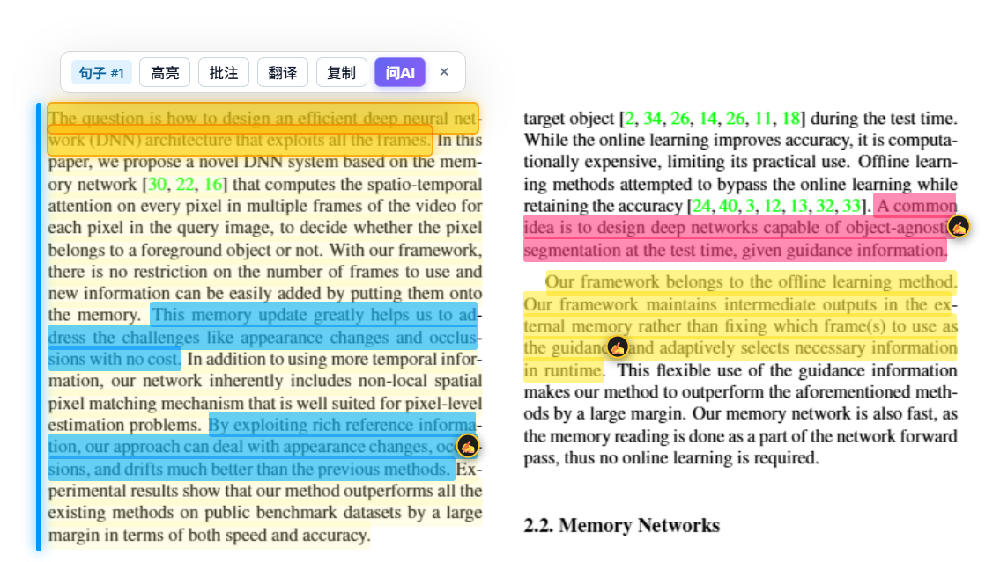
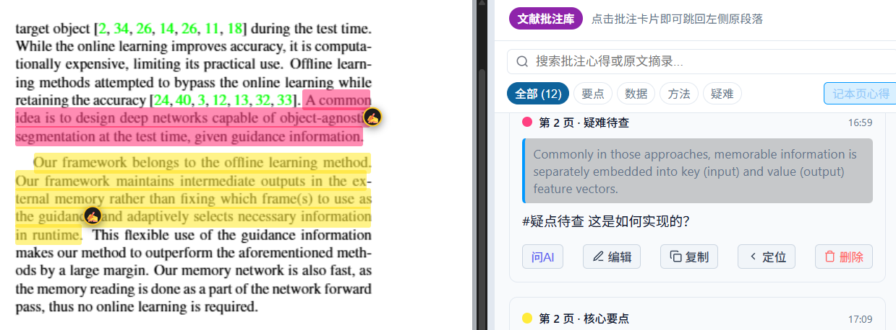
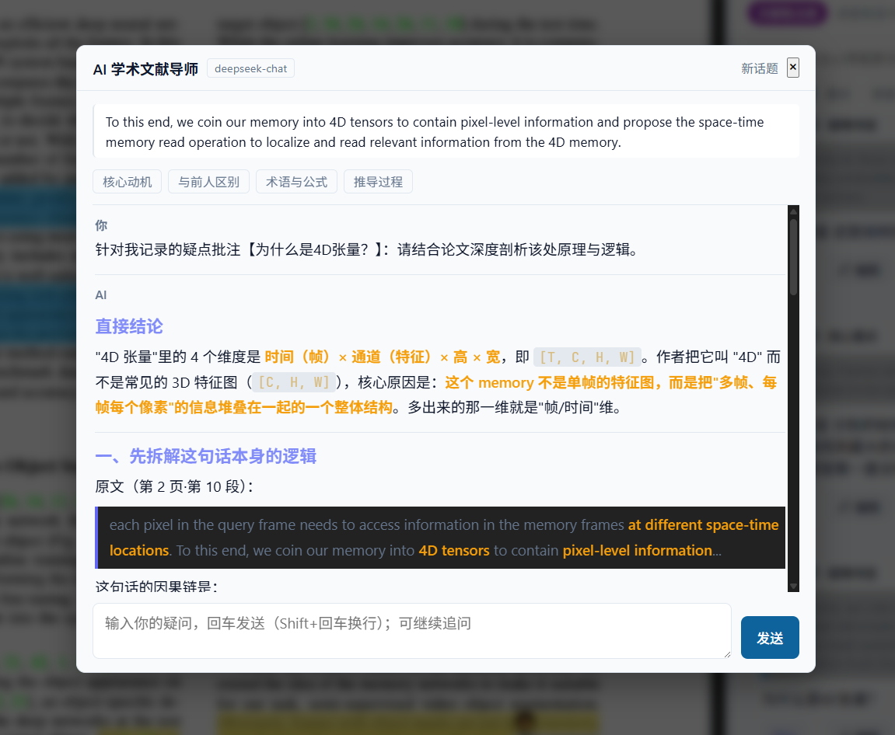

# Bilingual Paper Reader

> 学术论文双语对照阅读器

[](https://marketplace.visualstudio.com/items?itemName=paper-reader.academic-pdf-reader)
[](https://github.com/SevenFriends7/academic-pdf-reader/actions/workflows/ci.yml)
[](LICENSE)

<!--
徽章说明（避免以后又踩坑）：
- 市场版本/安装量徽章**不要**再用 img.shields.io/visual-studio-marketplace/*，
  该服务已停用，会渲染成一张写着 "retired badge" 的灰图。
  现在用 vsmarketplacebadges.dev（/version-short|/installs-short|/rating-short/<publisher>.<name>.svg）。
- 安装量还是 0 时先不放安装量徽章，等有数据再加。
-->

专为学术论文研读设计的 VS Code / 反重力 IDE (Antigravity IDE) 扩展插件：**左栏文献原文、右栏译文对照、鼠标划词实时双向高光联动、划线高亮与便签批注、一键导出 Markdown 笔记**。

**在扩展市场安装**：[paper-reader.academic-pdf-reader](https://marketplace.visualstudio.com/items?itemName=paper-reader.academic-pdf-reader)

---

## 🖼️ 界面预览

| 阅读与高亮 | 批注库 | AI 问答 |
| --- | --- | --- |
|  |  |  |

> 截图取自 VS Code 内的实际界面。更多截图欢迎通过 [Issues](https://github.com/SevenFriends7/academic-pdf-reader/issues) 提供。

---

---

## ✨ 核心特性

### 1. 📖 双栏文献对照阅读
- **左栏**：基于 PDF.js 完整渲染原版 PDF 文献，支持缩放（放大、缩小、适合宽度）、跳转翻页、高保真文字层（Text Layer）。
- **右栏**：支持【逐句精读】与【连贯段落】双模式自由切换，智能段落重组器（自动修复跨行断词与连字符，如 `differ- \n ent` 拼合），告别机械机翻的碎片感。
- **自由分栏**：中间配备可拖拽的 Splitter 分割条，随心调整左右视窗比例。

### 2. ⚡ 鼠标划词双向高光联动
- **左选右亮**：在左侧 PDF 中使用鼠标选中任意单词或句子，右侧对应的段落翻译卡片立即触发**发光呼吸灯高亮（Glow Highlight）**，并自动平滑滚动至视野正中，快速定位理解。
- **右点左闪**：点击右侧翻译卡片的“定位”按钮或段落本身，左侧 PDF 自动平滑滚动到该段落所在页面与位置，并以动态微光高亮闪烁，实现完美的双向视觉对齐。

### 3. ✍️ 划线高亮与便签批注
- **划词悬浮菜单 (Floating Action Bar)**：选中文字瞬间浮出 Notion 风格的工具条：
  - **4 色荧光笔高亮**：🟨 核心要点 / 🟩 论据数据 / 🟦 公式方法 / 🟥 疑难待查。
  - **添加批注便签**：记录个人理解、推导公式、文献对比心得。
  - **即时查词/译句**：无需切换页面，悬浮气泡即时展现当前短语的精准译文。
- **批注库管理**：右上角切换【批注笔记】视图，所有批注按页码聚合，支持点击一键跳转原文、修改、删除。
- **自动持久化**：所有批注与翻译缓存均自动保存在本地，下次打开同一篇文献无需重复翻译，所有标记与批注永久保留。

### 4. 📝 一键导出 Markdown 研读笔记
- 点击顶部【导出笔记】，自动生成结构化、美观的 Markdown 笔记文件（含原文字句、对照翻译、页码、高亮分类、个人批注与思考），无缝导入 **Obsidian**、**Notion** 或个人知识库。

### 5. 🌐 灵活强大的翻译引擎
- **Google Gemini 官方 API**：专为学术论文研读调优的学术 Prompt，术语地道严谨，公式与引用规范完整保留，Google AI Studio 提供免费额度。
- **自定义大模型 (DeepSeek / Kimi / 通义 / 智谱 / OpenAI / 本地模型)**：兼容 OpenAI 标准接口，国内直连、性价比高。设置里直接选常用模型，端点自动带出，只需填 API Key。
- **开箱即用 (内置免费翻译)**：无需申请任何 API Key，安装即可直接使用基础翻译。

> 翻译与 AI 问答共用所选引擎；问答会在提问界面标明"论文内容"与"通用背景知识"的来源区别。

---

## 📦 安装

### 方式一：扩展市场安装（推荐）

在扩展面板（`Ctrl+Shift+X`）搜索 **`Bilingual Paper Reader`**（中文可搜「论文 翻译」「文献 对照」等关键词），点击安装即可；后续版本会自动更新。

或直接打开商店页面：[paper-reader.academic-pdf-reader](https://marketplace.visualstudio.com/items?itemName=paper-reader.academic-pdf-reader)

### 方式二：从 VSIX 安装（离线 / 内网环境）

先取得 `academic-pdf-reader-x.y.z.vsix`，然后：

**在反重力 IDE (Antigravity IDE) 中安装**

1. 打开反重力 IDE。
2. 点击左侧活动栏的 **扩展市场** 图标（或按快捷键 `Ctrl+Shift+X`）。
3. 点击扩展视图右上角的 **`...` (更多操作)** 菜单。
4. 选择 **“从 VSIX 安装... (Install from VSIX...)”**。
5. 选中 `.vsix` 文件即可安装完成。

> 命令行等价写法：
> ```bash
> antigravity-ide.cmd --install-extension academic-pdf-reader-x.y.z.vsix --force
> ```

**在 VS Code 中安装**

1. 按 `Ctrl+Shift+X` 打开扩展面板。
2. 点击右上角 `...` 菜单 → 选择 **“从 VSIX 安装... (Install from VSIX...)”**。
3. 选中 `.vsix` 文件完成安装。

> 命令行等价写法：
> ```bash
> code --install-extension academic-pdf-reader-x.y.z.vsix --force
> ```

**安装后需要重启 IDE 才会生效**（或执行 `Developer: Reload Window`）。

---

## 🔑 如何配置 API Key

安装后打开任意 PDF，有三种方式配置：

### 方式一：阅读器右上角【设置】（最直观）

点击右侧顶栏的 **设置** 按钮，弹出快捷菜单：

| 菜单项 | 作用 |
| :--- | :--- |
| **配置模型 API（DeepSeek / Kimi / 通义 / OpenAI …）** | 先从常用模型列表里选一个（**端点自动带出**），再填 API Key 即可 |
| **配置 Google Gemini API Key** | 粘贴 Gemini Key，保存即生效（会先校验可用性） |
| **切换为内置免费翻译引擎** | 不需要任何 Key |
| **打开完整插件设置页面** | 进入 IDE 设置面板 |

> 选模型 → 填 Key 就完事，**不需要自己查 base URL 和模型名**。常用列表包含
> DeepSeek（deepseek-chat / deepseek-reasoner）、Kimi、通义千问、智谱 GLM、OpenAI、本地模型（Ollama/vLLM）等。

### 方式二：命令面板（`Ctrl+Shift+P`）

| 命令 | 作用 |
| :--- | :--- |
| `配置学术翻译引擎与 API Key (Gemini / DeepSeek / 内置免费)` | 设置向导 |
| `设置 Google Gemini API Key（并自动校验可用性）` | 直接填 Gemini Key |
| `从可用模型列表中选择翻译 / AI 问答模型` | 拉取该 Key 下真实可用的 Gemini 模型 |
| `导出当前文献批注为 Markdown` | 导出笔记 |
| `在双栏对照器中打开 PDF` | 打开阅读器 |

### 方式三：IDE 设置面板（`Ctrl+,` 搜 `academicReader`）

| 配置项 | 默认值 | 说明 |
| :--- | :--- | :--- |
| `translationService` | `gemini` | 引擎：`gemini` / `openai-compatible`（自定义模型）/ `built-in`（免费免 Key） |
| `geminiApiKey` | `""` | Google Gemini API Key |
| `geminiModel` | `gemini-3.6-flash` | Gemini 翻译模型 |
| `apiKey` / `apiEndpoint` / `modelName` | `""` / `https://api.deepseek.com/v1` / `deepseek-chat` | OpenAI 兼容引擎的密钥、端点、模型 |
| `aiModel` | `""` | 单独指定 AI 问答模型，留空沿用翻译模型 |
| `aiAnswerStyle` | `standard` | 问答风格：`standard` / `concise` / `reviewer` |
| `targetLanguage` | `zh-CN` | 目标语言（简中、繁中、英文、日语等） |
| `autoTranslate` | `true` | 翻页是否自动翻译当前页 |
| `translateConcurrency` | `3` | 并发翻译请求数上限（触发 429 时调低） |

---

## 💡 API Key 从哪里获取

### DeepSeek（国内直连，性价比高）

1. 到 [DeepSeek 开放平台](https://platform.deepseek.com/) 注册并创建 API Key；
2. 阅读器【设置】→【配置模型 API】→ 选 `deepseek-chat` → 粘贴 Key。端点会自动填好。

### Google Gemini（有免费额度）

1. 到 [Google AI Studio](https://aistudio.google.com/app/apikey) 创建 API Key；
2. 阅读器【设置】→【配置 Google Gemini API Key】粘贴即可。

> 两种引擎的翻译与 AI 问答是**同一套流程**：一次请求拿到「整段译文 + 严格逐句译文」，
> 并对译文做语言与术语保真校验。选哪个取决于你的网络条件与预算。

---

## 📄 许可证

[MIT](LICENSE) © academic-pdf-reader contributors

本扩展内嵌 [pdf.js](https://github.com/mozilla/pdf.js)（Apache-2.0），第三方声明见 [THIRD-PARTY-NOTICES.md](THIRD-PARTY-NOTICES.md)。

---

## 🔗 相关链接

- [更新日志](CHANGELOG.md) — 各版本改了什么
- [设计说明与问题复盘](docs/design-notes.md) — 历次问题的根因与修法
- [贡献与发布指南](CONTRIBUTING.md) — 本地构建、测试、发布流程
- [提交问题](https://github.com/SevenFriends7/academic-pdf-reader/issues)
